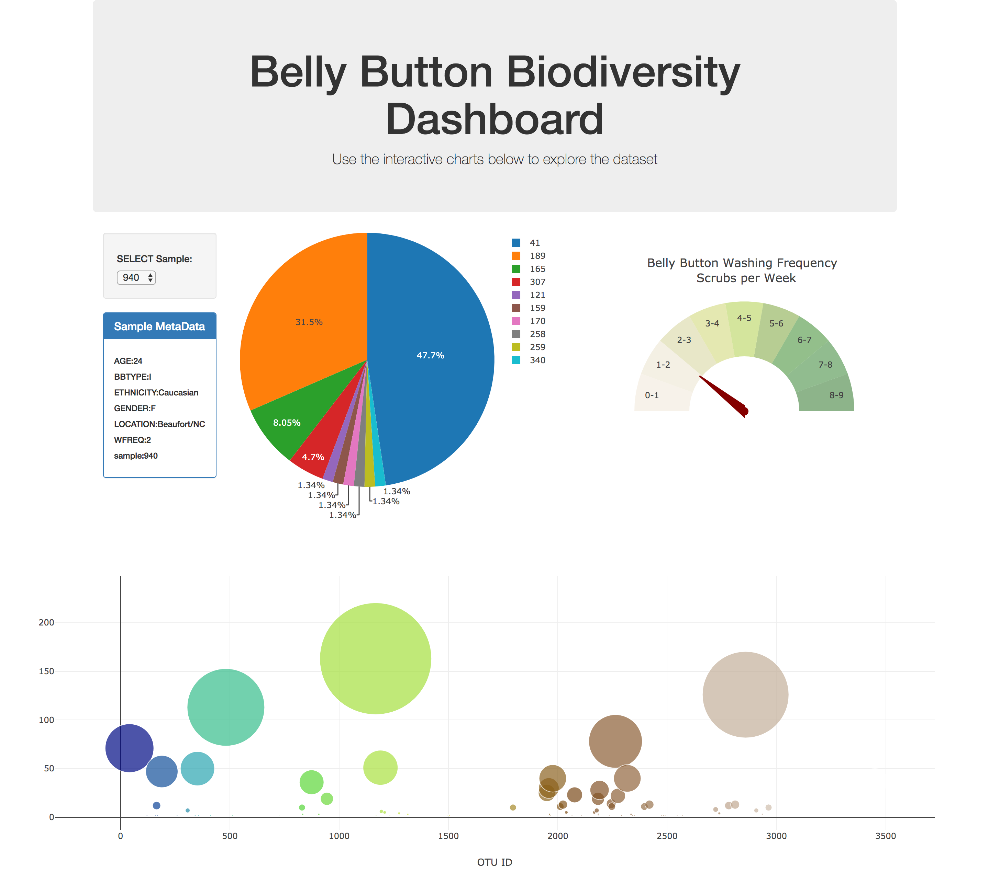

# Belly-Button-Biodiversity-DataSet
I built an interactive dashboard to explore the [Belly Button Biodiversity DataSet](http://robdunnlab.com/projects/belly-button-biodiversity/).

## Step 1 - Plotly.js

Use Plotly.js to build interactive charts for my dashboard.

* Create a PIE chart that uses data from samples route (`/samples/<sample>`) to display the top 10 samples.

  * Use `sample_values` as the values for the PIE chart

  * Use `otu_ids` as the labels for the pie chart

  * Use `otu_labels` as the hovertext for the chart

* Create a Bubble Chart that uses data from my samples route (`/samples/<sample>`) to display each sample.

  * Use `otu_ids` for the x values

  * Use `sample_values` for the y values

  * Use `sample_values` for the marker size

  * Use `otu_ids` for the marker colors

  * Use `otu_labels` for the text values

* Display the sample metadata from the route `/metadata/<sample>`

  * Display each key/value pair from the metadata JSON object somewhere on the page

* Update all of the plots any time that a new sample is selected.

## Step 2 - Heroku

Deploy Flask app to Heroku.

* Use the provided sqlite file for the database.

## Step 3 - Gauge Chart

* Adapt the Gauge Chart from <https://plot.ly/javascript/gauge-charts/> to plot the Weekly Washing Frequency obtained from the route `/wfreq/<sample>`

* Modify the example gauge code to account for values ranging from 0 - 9.

* Update the chart whenever a new sample is selected

- - -

## Flask API

Use Flask API starter code to serve the data needed for my plots.

* Test routes by visiting each one in the browser.

